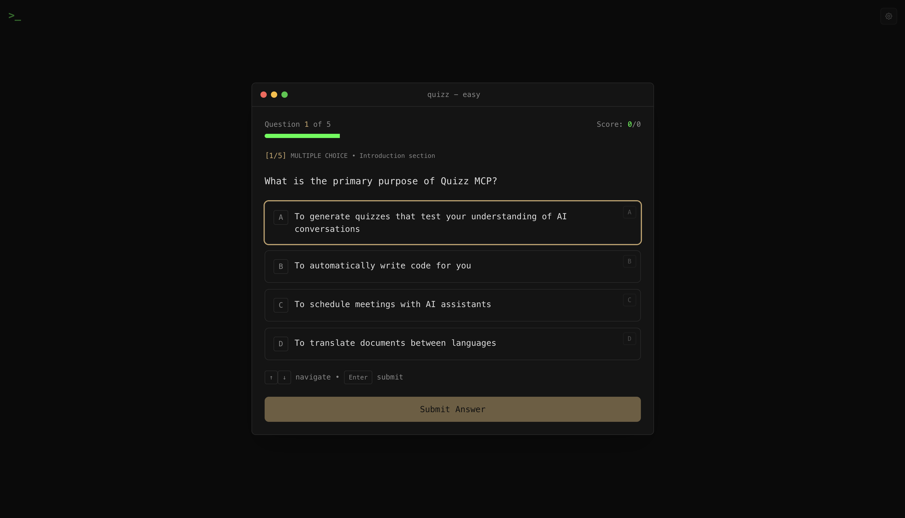
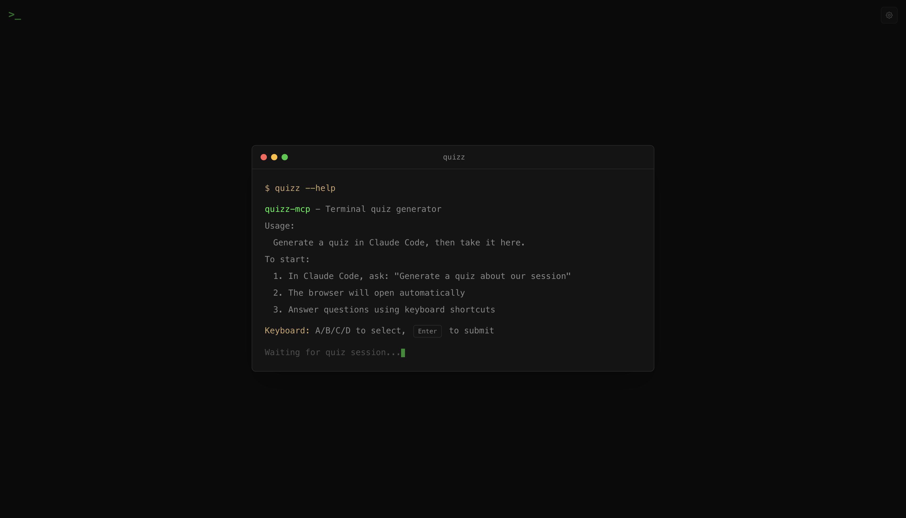
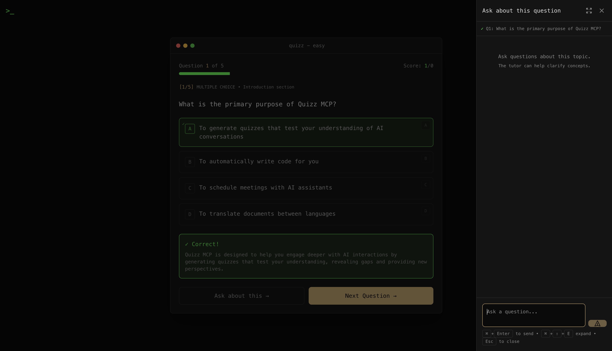
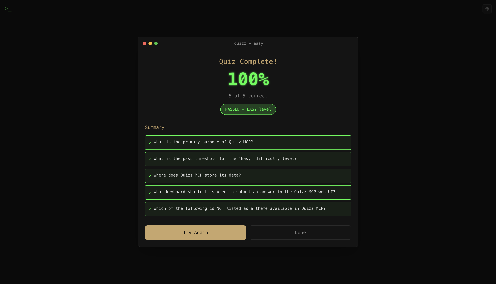
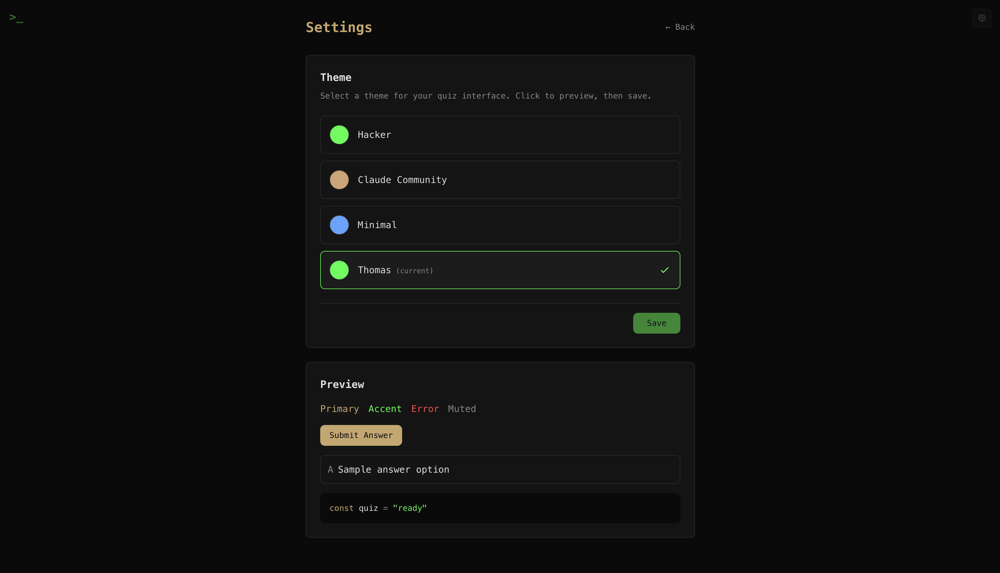
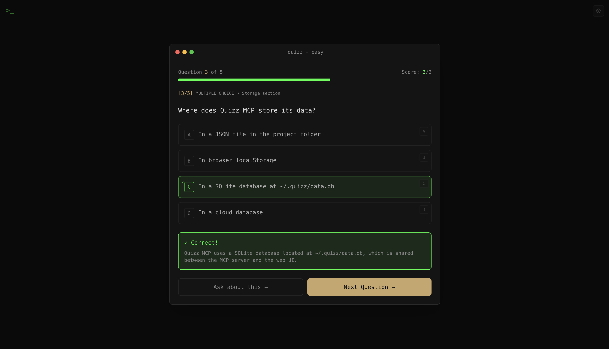

<p align="center">
  
</p>

<p align="center">
  Turn your Claude conversations into learning opportunities.
</p>

<p align="center">
  
</p>

---

When you're exploring a new concept, debugging code, or learning a framework through Claude or Claude Code, how much are you actually retaining? Quizz MCP helps you engage deeper with your AI interactions by generating quizzes that test your understanding - giving you new perspectives and revealing gaps you didn't know you had.

## Why?

Reading explanations feels like understanding. But real comprehension comes from actively recalling and applying concepts. Quizz creates that active engagement:

- **Test yourself** on code you just reviewed
- **Discover blind spots** in your understanding
- **Get AI feedback** on your reasoning, not just right/wrong
- **Track progress** across topics over time

## Getting Started

### 1. Install

```bash
git clone https://github.com/ThoBustos/quizz-mcp.git
cd quizz-mcp
pnpm install && pnpm build
```

Requires: Node.js 20.11+, pnpm 8+

### 2. Configure Claude Code

Add to your MCP settings (`~/.claude/settings.json` or project `.mcp.json`):

```json
{
  "mcpServers": {
    "quizz": {
      "command": "node",
      "args": ["/absolute/path/to/quizz-mcp/packages/mcp/dist/index.js"],
      "env": {
        "ANTHROPIC_API_KEY": "sk-ant-..."
      }
    }
  }
}
```

### 3. Start the Web UI

```bash
cd quizz-mcp
pnpm dev
```

Opens at `http://localhost:9004`

<p align="center">
  
</p>

### 4. Generate Your First Quiz

In Claude Code, just ask:

```
Quiz me on what we just discussed
```

Or be specific:

```
Generate a quiz about React hooks - 5 questions, medium difficulty, mix of multiple choice and code writing
```

Claude will ask you to confirm:
- **Content**: What to quiz on
- **Difficulty**: Easy, Medium, Hard, or Expert
- **Question count**: 1-20 questions
- **Question types**: Multiple-choice, multi-select, open-ended, or code-writing

Then it opens the quiz in your browser.

## Taking a Quiz

### Keyboard Navigation

| Key | Action |
|-----|--------|
| `A-D` | Jump to option |
| `↑/↓` | Navigate options |
| `Space` | Toggle selection (multi-select) |
| `Enter` | Submit answer |
| `Cmd+Enter` | Submit code answer |
| `Cmd+Shift+E` | Expand/collapse AI chat |

### AI Chat

After each answer, you can chat with Claude about the question. Ask for clarification, explore edge cases, or dive deeper into concepts. Click the expand button (or `Cmd+Shift+E`) for a full-screen chat experience.

<p align="center">
  
</p>

The chat supports code blocks, markdown, LaTeX math, and more:

<p align="center">
  
</p>

### Difficulty Levels

| Level | Pass Threshold | What It Tests |
|-------|---------------|---------------|
| Easy | 50% | Basic recall, main ideas |
| Medium | 60% | Comprehension, patterns, "how" and "why" |
| Hard | 75% | Analysis, connections, trade-offs |
| Expert | 85% | Critical evaluation, edge cases, alternatives |

## Quiz Results

When you complete a quiz, you'll see your score and a summary of all questions. Hit **Try Again** to reinforce your learning with spaced repetition.

<p align="center">
  
</p>

## Viewing Your Progress

In Claude Code:

```
Show my quiz stats
```

Or use the `quiz_stats` tool to see:
- Total quizzes taken
- Average scores by difficulty
- Recent session history

## Themes

Go to Settings (gear icon) to configure your theme:

<p align="center">
  
</p>

| Theme | Style |
|-------|-------|
| **Hacker** | Matrix green terminal aesthetic (default) |
| **Claude Community** | Warm Claude orange tones |
| **Minimal** | Clean blue GitHub-style |
| **Thomas** | Green accents + amber buttons |

Your preference is saved locally.

## Troubleshooting

**Quiz won't generate?**
- Ensure `ANTHROPIC_API_KEY` is set in your MCP config
- Check that the path to `packages/mcp/dist/index.js` is absolute

**Browser doesn't open?**
- Start the web UI manually: `pnpm dev`
- Navigate to `http://localhost:9004/quiz/{session-id}`

**Database errors?**
- The database is stored at `~/.quizz/data.db`
- Both MCP server and web UI share this database

<p align="center">
  
</p>

> **Fun fact:** SQLite is the most deployed database in the world - it's in your phone, browser, car, and now tracking your quiz scores. Your learning progress is literally stored in the same format as aircraft flight systems. No pressure.

## For Developers

See [DESIGN.md](./DESIGN.md) for architecture details, or explore:

```bash
pnpm test          # Run tests
pnpm lint          # Check code style
pnpm typecheck     # Type checking
```

## License

MIT
